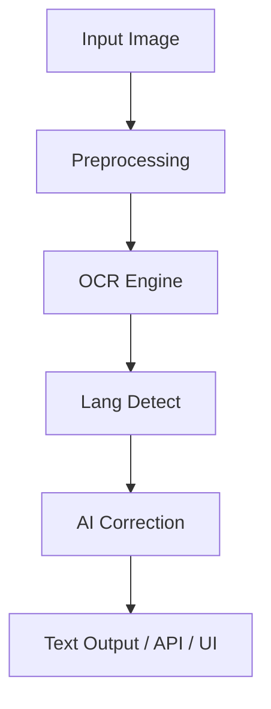

# OmniOCR – Architecture Overview

---

## Core Design Principles

**Modular:** Each functionality isolated (OCR engine, AI correction, UI, APIs)

**Offline-first:** All components work without internet (optional AI-enhanced features online)

**Cross-platform:** Desktop (PySide6), Mobile (Compose), Web (Streamlit)

---

## Module Breakdown

### `core/`

`ocr_engine.py`: main OCR controller (Tesseract/EasyOCR)

`preprocessor.py`: image enhancements (grayscale, contrast)

`postprocessor.py`: rule-based fixes

### `ai/`

`lang_detect.py`: language detection (langdetect)

`post_correction.py`: BERT-powered error correction

### `desktop/`

PySide6 GUI

`styles/material.qss`: Material Design QSS theme

### `mobile/composeApp/`

Compose Multiplatform UI (Android/iOS/Desktop)

Material 3 theming (`Theme.kt`)

`OcrHelper.kt`: OCR API bridge

### `interface/`

`api.py`: FastAPI OCR service

`ui_streamlit.py`: Streamlit UI with Material-style CSS

### `tests/`

`test_ocr.py`: Unit test for OCR + correction pipeline

---

## Data Flow

---

## Extensibility

Add new OCR engines (TrOCR, PARSeq)

Replace UI frontends (React, Compose Desktop)

Plug-in based output formatters (e.g. CSV, EPUB)

---

## Roadmap Integration

See `ROADMAP.md` for tracked progress on each architecture block.

> Maintained by: @GeekNeuron

